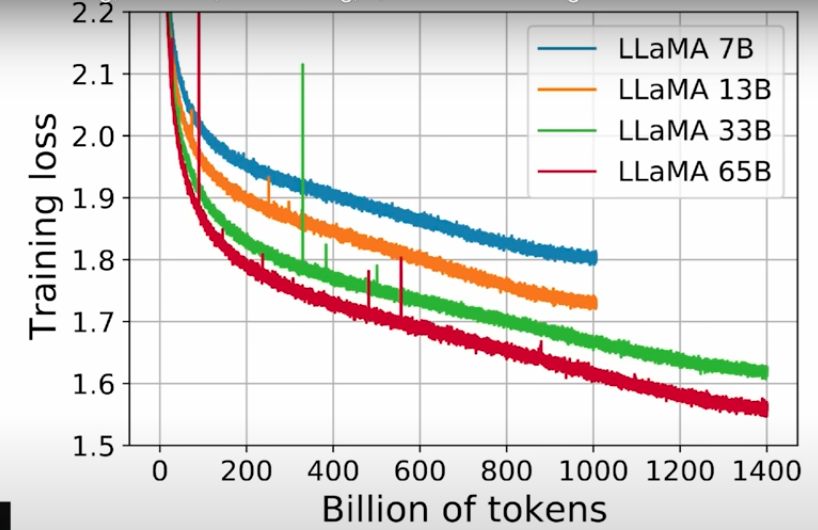

- draw.io [As I proceed, I need to have a big-picture overview]
- Qwen-code-blocks + His talk arguments (`in own words`)
- `RL basics in this talk` + `GPT assistance` + `Vizuara (for inner workings)`

#### Evolution of LLMs

- The hypotheis -> More the number of tokens smarter the model?
- Generally, the loss is `1-ish/2-ish`. If we ghet losses of 8/9 etc, something is wrong.

#### Open-src vs Closed src models

- The trend is that open-src has caught upto closed src models
- `llama-3.1` has caught upto `gpt-4o`

#### Capabilty vs Time (OSS drought)

- RL Jump
  - After september 4, there were no developments in `Open-src` community that could challenge the Closed src ones
  - No significant improvemnet phases
  - This was when `DeepSeek R1` came along

- SFT, RLHF Jump
  - Also, before chatgpt came along that was in `Sept 2022`, there were LLMs
  - It's just that those were `base` models
  - Chatgpt showed how, good `datasets`, good `instructions`, good `reinforcement learning with HF` and good `supervised finetuning` can actually make the model very useful

#### Cake analogy

- `Cake`: Unsupervised Learning (`pretraining in general`)
  - Most ML Labs start with this large pre-traiined models.
- `Icing`: Supervised FT
  - Then they supervise on some dataset
  - Then, they will iteratively make the model better through Supervised Learning or RL.
- `Cherry`: RL
  - Very less data to train on.

#### Base to Chat models

- Generally, we start with a `base` model i.e `pre-trained i.e Unsupervised FT`
  - For e.g: `Chatgpt` is the IT version of the base model called `GPT-3.5` back when released.
  - The base model is sitting somewhere on the server (`probably never going to be served`)

- The arrow, here refers to `How are we going to convert Base to Chat model?` Is it `SFT or RL` ?
- This is the most imp question.
> [!NOTE]
> - IT: Instruction-tuned
> - PT: Pretrained